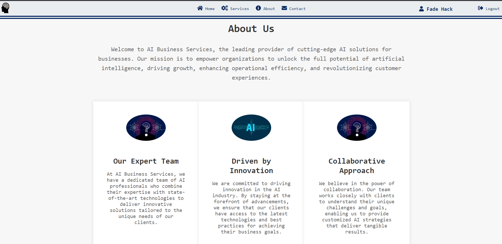

## AI Business Solutions

## Description

AI Business Solutions is a web application that offers cutting-edge artificial intelligence services to companies. The application provides features such as user registration and login, displaying company information, showcasing available services, and a contact form for inquiries. It aims to assist businesses in harnessing the power of AI to optimize their operations and drive growth.

## Technologies

The project is built using the following technologies:

- Python
- Flask
- MongoDB
- HTML/CSS
- JavaScript

## Screenshots

### Home Page
Before Login

After Login

Companies
- Fetch data from the database and shows

Gallery

Description: The home page displays information about the companies using AI Buisness Solutions and showcases gallery.

### Services Page
- Fetch data from the database and shows

Description: The services page lists the available AI services offered by the company.

### About Page

Description: The about page provides an overview of the company's mission and expertise in the AI domain.

### Login/Register Page

Description: The login page allows users to log in to access additional features and personalized content.

### Contact Form

Description: The contact form enables users to send inquiries or messages to the AI Business Solutions team.

## How to Run

To run the AI Business Solutions project locally, follow these steps:

1. Clone the project repository: `git clone https://github.com/FadeHack/Ai-Business-Services.git`
2. Navigate to the project directory: `cd Ai-Business-Solutions`
3. Install the project dependencies: `pip install -r requirements.txt`
4. Set up the MongoDB database and update the connection URI in `app.py`.
5. Run the application: `python app.py`
6. Open your web browser and access the application at `http://localhost:5000`.

## License

This project is licensed under the MIT License. See the [LICENSE](LICENSE) file for more information.
